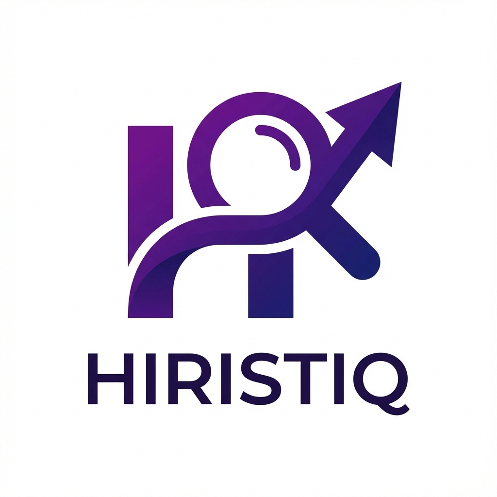
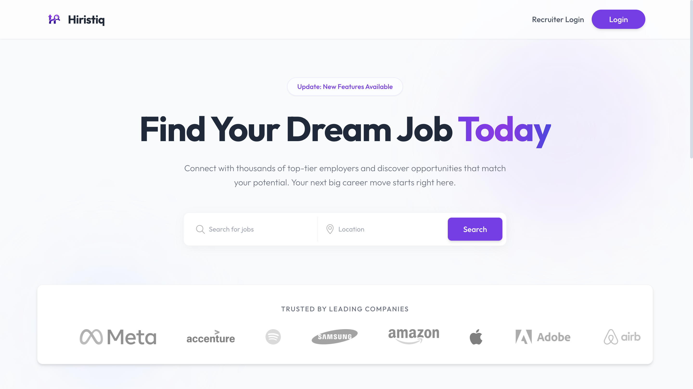
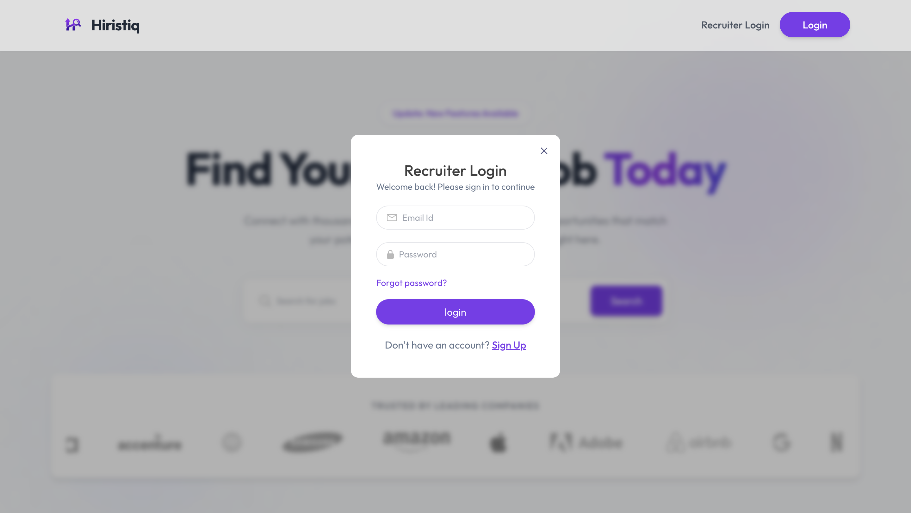
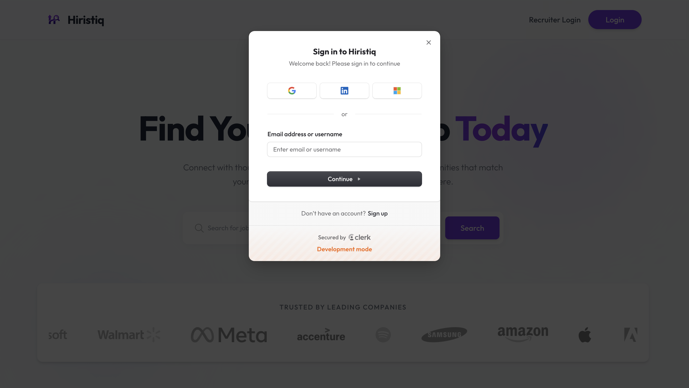
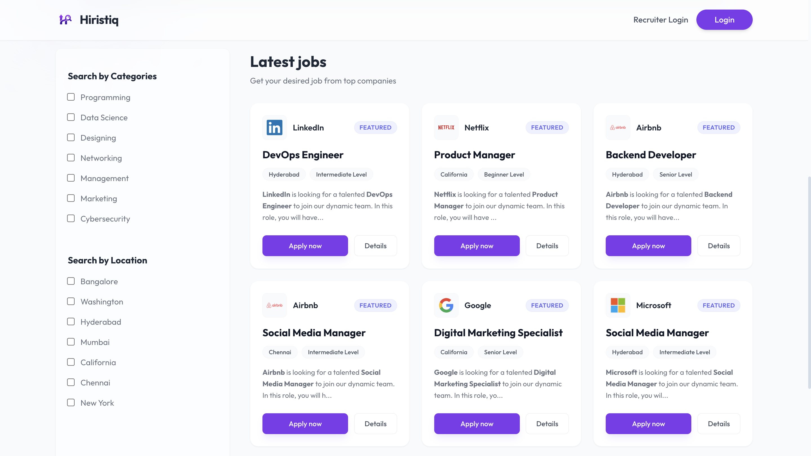
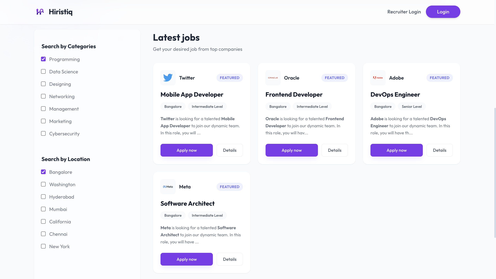
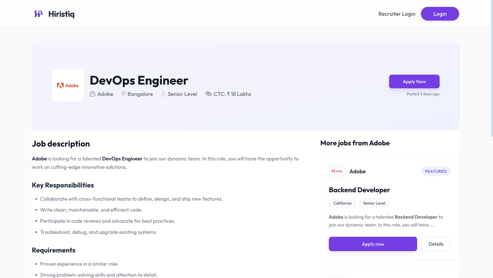
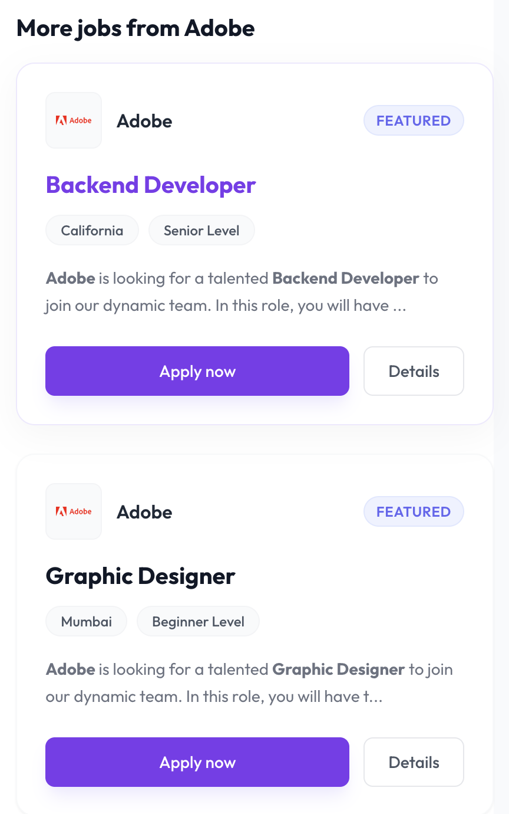
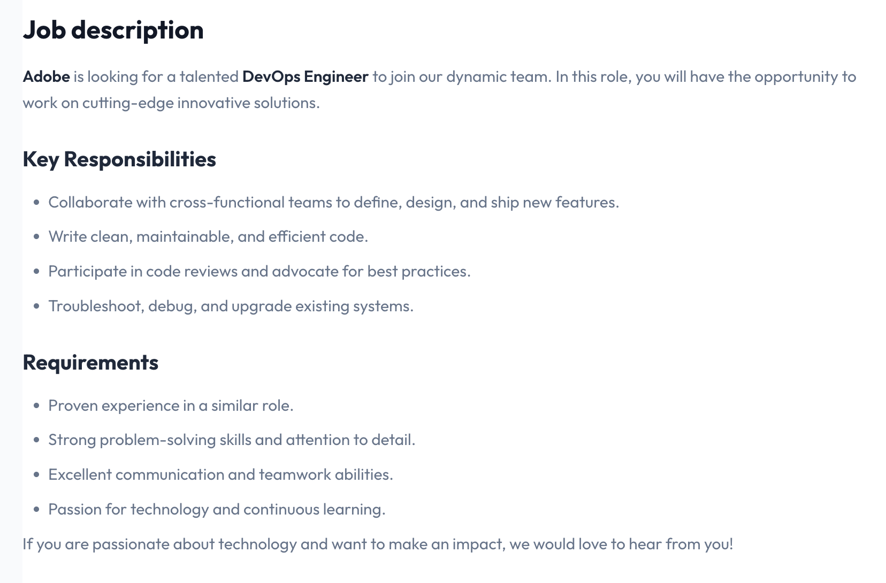

# ETHNUS CODEMITHRA Certification Project

**Sr. No.:** 28

**Project Title:** Job Board

**Brief Description:** Create a platform for job seekers and employers to connect, post job listings, and find suitable candidates.	

**Technologies:**	
- MongoDB
- ReactJS
- NodeJS
- ExpressJS

**Domain:**	Employment

**Expected Outcomes:** Understanding of CRUD operations, user authentication

---

Welcome to the **Hiristiq Job Portal**! This is a full-stack job portal application built using the MERN stack (MongoDB, Express, React, Node.js). It features a modern, premium UI/UX, role-based access for Job Seekers and Recruiters, and real-time application tracking.

<p align="center"></p>

---

## 🚀 Features

- **Premium UI/UX**: Glassmorphism design, smooth animations, and responsive layout.
- **Role-Based Access**: Separate dashboards for Candidates and Recruiters.
- **Job Management**: Recruiters can post, edit, and manage job listings.
- **Application Tracking**: Candidates can apply for jobs and track status (Applied, Accepted, Rejected).
- **Email Notifications**: Automated emails for job applications and status updates.
- **Secure Authentication**: Powered by **Clerk** for robust user management.
- **Resume Upload**: Integrated with **Cloudinary** for secure file storage.

---

## 🛠️ Tech Stack

- **Frontend**: React.js, Vite, Tailwind CSS
- **Backend**: Node.js, Express.js
- **Database**: MongoDB
- **Authentication**: Clerk
- **File Storage**: Cloudinary
- **Email Service**: Nodemailer

---

## 📋 Prerequisites

Before running the project, ensure you have the following installed:

1.  **Node.js** (v18 or higher)
2.  **npm** (Node Package Manager)
3.  **MongoDB Connection String** (Atlas or Local)
4.  **Clerk API Keys**
5.  **Cloudinary API Keys**

---

## ⚙️ Installation & Setup (Windows & Mac)

Follow these steps to run the project locally on your machine.

### 1. Clone the Repository

```bash
git clone https://github.com/jayesh3103/Ethnus_Certification_Project.git
cd Ethnus_Certification_Project
```

### 2. Setup Server (Backend)

Navigate to the `server` directory and install dependencies:

**Mac/Linux:**

```bash
cd server
npm install
```

**Windows:**

```bash
cd server
npm install
```

**Configure Environment Variables:**
Create a `.env` file in the `server` directory and add your credentials:

```env
PORT=5001
MONGODB_URI=your_mongodb_connection_string
CLERK_PUBLISHABLE_KEY=your_clerk_publishable_key
CLERK_SECRET_KEY=your_clerk_secret_key
CLERK_WEBHOOK_SECRET=your_clerk_webhook_secret
CLOUDINARY_NAME=your_cloudinary_name
CLOUDINARY_API_KEY=your_cloudinary_key
CLOUDINARY_SECRET_KEY=your_cloudinary_secret
SMTP_HOST=smtp.gmail.com
SMTP_PORT=587
SMTP_USER=your_email@gmail.com
SMTP_PASS=your_email_password
SENDER_EMAIL=your_email@gmail.com
JWT_SECRET=your_jwt_secret
```

### 3. Setup Client (Frontend)

Open a new terminal, navigate to the `client` directory, and install dependencies:

**Mac/Linux:**

```bash
cd client
npm install
```

**Windows:**

```bash
cd client
npm install
```

**Configure Environment Variables:**
Create a `.env` file in the `client` directory:

```env
VITE_CLERK_PUBLISHABLE_KEY=your_clerk_publishable_key
VITE_BACKEND_URL=http://localhost:5001
```

---

## ▶️ Running the Application

You need to run both the backend and frontend servers simultaneously.

### 1. Start the Backend Server

In your **server** terminal:

```bash
npm start
```

_Expected Output: `Server is running on port 5001` & `Database Connected`_

### 2. Start the Frontend Client

In your **client** terminal:

```bash
npm run dev
```

_Expected Output: `Local: http://localhost:5173/`_

### 3. Access the App

Open your browser and go to: **[http://localhost:5173](http://localhost:5173)**

---

## 📸 Application Screenshots

Here is a walkthrough of the application features:

<br>

<p align="center">
  
  <br>
  <em>Home Page: Landing page with job search and featured companies.</em>
</p>

<p align="center">
  
  <br>
  <em>Job Search: Advanced filtering by category, location, and role.</em>
</p>

<p align="center">
  
  <br>
  <em>Job Details: Comprehensive view of job requirements and "Apply Now" action.</em>
</p>

<p align="center">
  
  <br>
  <em>Authentication: Secure login and sign-up powered by Clerk.</em>
</p>

<p align="center">
  
  <br>
  <em>Dashboard: Overview for Recruiters/Candidates.</em>
</p>

<p align="center">
  
  <br>
  <em>Job Posting: Interface for recruiters to create new job listings.</em>
</p>

<p align="center">
  
  <br>
  <em>Application Management: Recruiters can view and manage applicant status.</em>
</p>

<p align="center">
  
  <br>
  <em>User Profile: Profile management and resume upload section.</em>
</p>

<br>

---

**Built by [Jayesh Muley](https://github.com/jayesh3103)**

**Last Updated**: December 23, 2025
